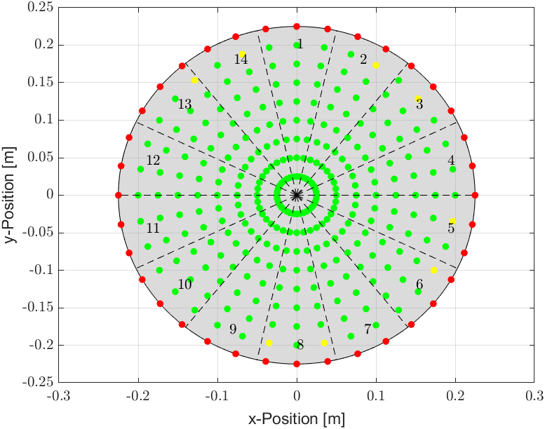

# Portfolio

## Bachelorarbeit: Entwurf einer Fuzzy-Regelung für den rotatorischen Verteilteller einer Mehrkopfwaage

Change language here: 

Der Code meiner Bachelorarbeit kann in folgendem Repository eingesehen werden: [Repository](https://github.com/alexandernit/github-portfolio)

Meine Arbeit befasste sich mit der Verbesserung der Produktverteilung auf dem Verteilteller einer Mehrkopfwaage (siehe Abb.1) durch Implementierung zweier Fuzzy-Regler, die den gezielten Abwurf vom Verteilteller auf eine Dosierrinne ermöglichen. Das bestehende Modell wurde erweitert (*dynamics.m*), um die Dynamik eines Gleichstrommotors und die Rückkopplungseffekte von Partikeln zu berücksichtigen und zusätzlich wurde die Bewegung mehrerer Partikel (*multidynamics.m*) auf dem Verteilteller untersucht. Zwei Regelungskonzepte, ein Mamdani-Fuzzy-Regler (*mamdani2.fis*) und eine Takagi-Sugeno-Fuzzy-Regelung (*takagi1.fis*), wurden entwickelt.

|  |
| :--: |
| Abb.1.: Verwiegeprozess einer Mehrkopfwaage |
|*(Videoquelle: https://youtu.be/TVnA-7kJC74?si=OCO03Gl8Bz4dd9fg)* |

Durch Simulation (*fuzzySimulateWithConstInput.m*) über alle möglichen Abwurfpositionen konnten beide Fuzzy-Regler validiert werden. Beide Regler zeigten dabei sehr gute Ergebnisse (siehe Abb. 2), wobei grüne und gelbe Abwurfunkte für erfolgreiche Regelungssimulationen und rote nicht erfolgreich waren. Für die Regelung mehrerer Partikel wurde ein erster Simulationsversuch (*multiFuzzySimulateWithConstInput.m*) unternommen.

   
Abb.2.: Ergebnisse Mamdani-Fuzzy-Regler (links) und Takagi-Fuzzy-Regler (rechts)

